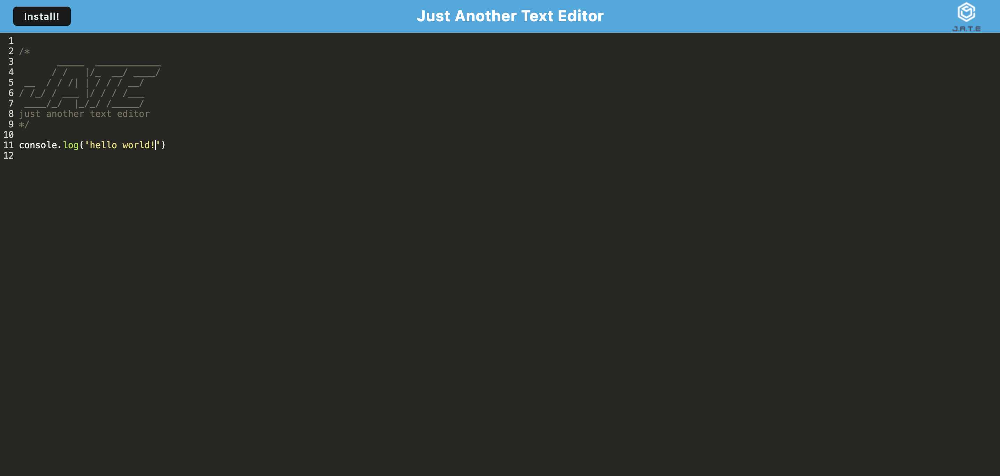

# EditEpic 
    
## Description 
      
I built this app to further my understanding of Progressive Web Applications (PWAs). The application serves as a simple text editor with an added feature, a install button that allows users to download the app onto their devices. Throughout the development process, I encountered several challenges, one of which proved a bit frustrating: the install button wasn't functioning as expected.Turns out, I made a few mistakes in my initial setup in the install.js file. To tackle the problem, I went back to the classwork, rewatched some lectures, and figured out how to make that button work. In the end, I fixed it and learned a lot about PWAs in the process.

https://editepic.onrender.com

## Usage

This app is easy to use, just like any other text editor. Simply start typing away. You can also download the app to use it offline or when you don't have access to the internet. Just click install and wait a few seconds.
      
## License
  
This project is licensed under the terms of the MIT License 
